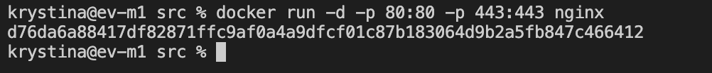
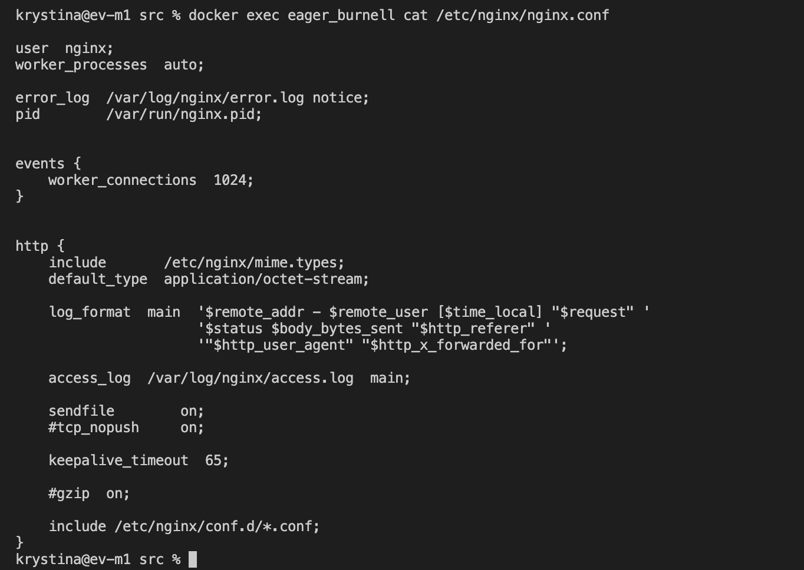

#Simple Docker

Введение в докер. Разработка простого докер образа для собственного сервера.

## Part 1. Готовый докер

##### 1) Взял официальный докер образ с nginx и выкачал его при помощи docker pull

Рис. 1 Подгрузка образа с nginx

##### 2) Проверил наличие докер образа через docker images

Рис. 2 Применение docker images для проверки наличия образов

##### 3) Запустил докер образ через docker run -d nginx

Рис. 3 Запуск образа при помощи docker run -d nginx

##### 4) Проверил, что образ запустился через docker ps

Рис. 4 Проверка запущенных образов

##### 5) Посмотреть информацию о контейнере через docker inspect [container_id|container_name] (в моём случае имя контейнера "awesome_pascal")

Рис. 5 Частичная информация о контейнере awesome_pascal

##### 6) По выводу команды определил и поместил в отчёт размер контейнера, список замапленных портов и ip контейнера

Рис. 6 Размер контейнера 

Рис. 7 Список замапленных портов

Рис. 8 ip контейнера

##### 7) Остановил докер образ через docker stop и проверил, что образ остановился через docker ps

Рис. 9 Остановка образа и проверка остановки

##### 8) Запустил докер с портами 80 и 443 в контейнере, замапленными на такие же порты на локальной машине, через команду run

Рис. 10 Запуск докера с необходимыми замапленными портами

##### 9) Проверил, что в браузере по адресу localhost:80 доступна стартовая страница nginx

Рис. 11 Адрес localhost:80 в браузере

##### 10) Перезапустил докер контейнер через docker restart [container_id|container_name] (теперь имя контейнера eager_burnell) и проверил запуск при помощи docker ps

Рис. 12 Перезапуск докера и проверка перезапуска

## Part 2. Операции с контейнером

##### 1) Прочитал конфигурационный файл nginx.conf внутри докер контейнера через команду exec

###### Exec отвечает за запуск команды внутри запущенного контейнера

Рис. 13 Содержание конфигурационного файла nginx.conf внутри контейнера

##### 2) Создал на локальной машине файл nginx.conf. Настроил в нем по пути /status отдачу страницы статуса сервера nginx

Рис. 14 Содержание конфигурационного файла nginx.conf на локальной машине 

##### 3) Скопировал созданный файл nginx.conf внутрь докер образа через команду docker cp. 

Рис. 15  Копирование файла внутрь докер образа

##### 4) Перезапустил nginx внутри докер образа через команду exec.

Рис. 16 Перезапуск nginx через exec

##### 5) Проверил, что по адресу localhost:80/status отдается страничка со статусом сервера nginx

Рис. 17 Страница localhost:80/status

##### 6) Экспортировал контейнер в файл container.tar через команду export

Рис. 18 Экспорт контейнера

##### 7) Остановил контейнер

Рис. 19 Остановка контейнера

##### 8) Удалил образ через docker rmi [image_id|repository], не удаляя перед этим контейнеры

Рис. 20 Удаление образа

##### 9) Удалил установленный контейнер

Рис. 21 Удаление контейнера

##### 10) Импортировал контейнер обратно через команду import

Рис. 22 Импорт контейнера

##### 11) Запустил импортированный контейнер 

Рис. 23 Запуск контейнера

##### 12) Проверил, что по адресу localhost:80/status отдаётся страничка со статусом сервера nginx

Рис. 23 Проверка адреса через терминал

Рис. 24 Проверка адреса через браузер

# Следующие задания необязательно вставлять в отчёт, но на всякий случай сделал

## Part 3. Мини веб-сервер

##### 1) Написал мини сервер на C и FastCgi, который будет возвращать простейшую страничку с надписью Hello World!

Рис. 25 Мини сервер для Hello World!

##### 2) Запустил написанный мини сервер через spawn-fcgi на порту 8080

Рис. 26 Запуск мини сервера

##### 3) Написал свой nginx.conf, который будет проксировать все запросы с 81 порта на 127.0.0.1:8080

Рис. 27 Конфиг nginx.conf, собственный

##### 4) Проверил, что в браузере по localhost:81 отдается написанная вами страничка

Рис. 28 Проверка адреса в браузере

##### 5) Положил файл nginx.conf по пути ./nginx/nginx.conf (это понадобится позже)

## Part 4. Свой докер

#### Написал свой докер образ, который: 

##### 1) собирает исходники мини сервера на FastCgi из Части 3

##### 2) запускает его на 8080 порту

##### 3) копирует внутрь образа написанный ./nginx/nginx.conf

##### 4) запускает nginx.

Рис. 29 Докер образ

#### Собрал написанный докер образ через docker build при этом указав имя и тег

Рис. 30 Сборка докер образа

#### Проверил через docker images, что все собралось корректно

Рис. 31 Проверка на корректность сборки

#### Запустил собранный докер образ с маппингом 81 порта на 80 на локальной машине и маппингом папки ./nginx внутрь контейнера по адресу, где лежат конфигурационные файлы nginx'а (см. Часть 2)

Рис. 32 Запуск образа с маппингом

#### Проверил, что по localhost:80 доступна страничка написанного мини сервера

Рис. 33 Проверка по localhost:80

#### Дописал в ./nginx/nginx.conf проксирование странички /status, по которой надо отдавать статус сервера nginx

Рис. 34 Обновленный конфиг со страницей /status

#### Перезапустил докер образ

Рис. 35 Перезапуск докер образа

#### Проверить, что теперь по localhost:80/status отдается страничка со статусом nginx

Рис. 36 Проверка localhost:80/status

## Part 5. Dockle

#### Просканировал образ из предыдущего задания через dockle [image_id|repository]

Рис. 37 Cкан через dockle

#### Исправил образ так, чтобы при проверке через dockle не было ошибок и предупреждений

Рис. 38 Повторный скан исправенного образа

# ВАЖНО

### Dockle ругается на nginx-ключи, но они нужны для работы Докера. В этом задании, чтобы пройти проверку базовый образ был изменен на ubuntu, а затем обратно на nginx. В дальнейшем для прохождения проверок нужно при запуске dockle ставить исключение на nginx-ключи. Команда будет выглядеть так:

##### dockle -i CIS-DI-0010 *name:tag*

## Part 6. Базовый Docker Compose

#### Написал файл docker-compose.yml, с помощью которого:

##### 1) Поднял докер контейнер из Части 5

##### 2) Поднял докер контейнер с nginx, который будет проксировать все запросы с 8080 порта на 81 порт первого контейнера

Рис. 39 Файл docker-compose.yml на два контейнера с маппинг 8080 на 80 локалки

Рис. 40 Nginx конфиг с прокси с 8080 на 81

#### Замапил 8080 порт второго контейнера на 80 порт локальной машины (см. Рис. 39)

#### Остановил все запущенные контейнеры

Рис. 41 Все запущенные контейнеры остановлены

#### Собрал и запустил проект с помощью команд docker-compose build и docker-compose up

Рис. 42 Сборка и запуск проекта

#### Проверил, что в браузере по localhost:80 отдается написанная страничка, как и ранее

Рис. 43 Проверка localhost:80 по браузеру